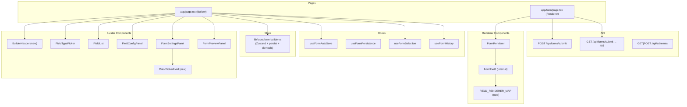
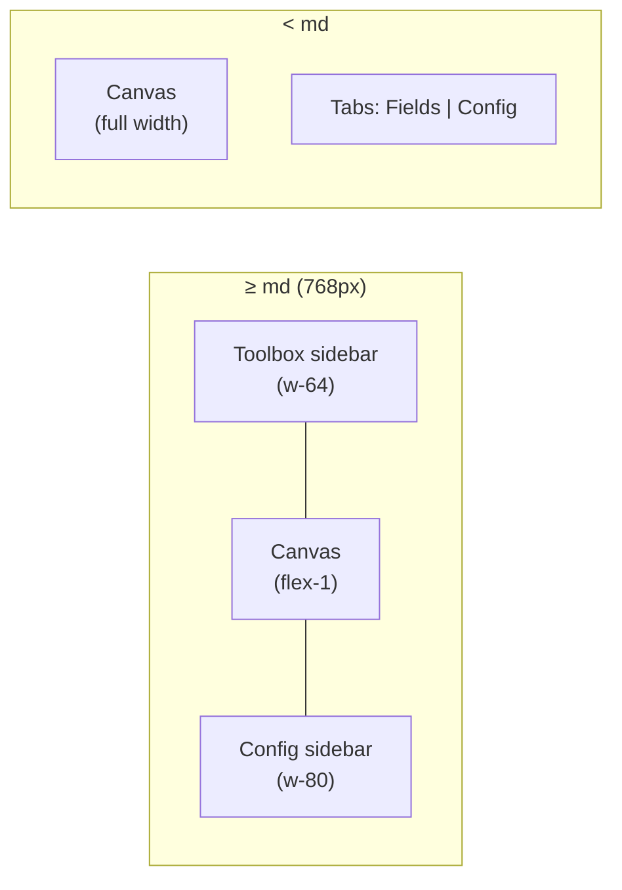

# Design Document: Codebase Refactor and Accessibility Overhaul

## Overview

This document describes the technical design for a structural refactor and WCAG 2.1 AA accessibility overhaul of the Next.js Form Builder application. No new user-visible functionality is introduced. The work falls into five categories:

1. **Bug fixes** — four discrete defects in the store, API route, and page files
2. **Code quality** — extract components, replace conditionals with a lookup map, remove dead code and debug artifacts
3. **Performance** — stabilise callbacks, fix debounce memoisation, cap history stack
4. **Responsiveness** — replace fixed-width sidebars with responsive Tailwind breakpoints
5. **Accessibility** — WCAG 2.1 AA compliance on both the Builder and Renderer surfaces

All changes are backward-compatible. The public API of every component and hook remains the same unless explicitly noted.

---

## Architecture

The application has two surfaces sharing a single Zustand store:



### Key Architectural Changes

| Area | Before | After |
|---|---|---|
| Store `DEFAULT_FORM.id` | `generateId()` called at module load | ID generated lazily inside store factory |
| Store `pushHistory` | Called via `get().pushHistory()` inside `set()` | Inlined directly into each mutating `set()` callback |
| History cap | Unbounded | `MAX_HISTORY_SIZE = 50` enforced on every push |
| `updateSettings({ name })` bug | `updateSettings` merges into `FormSchema.settings` | `updateForm({ name })` merges into top-level `FormSchema` |
| `FormField` rendering | 200-line chained `if/else` | `FIELD_RENDERER_MAP` lookup |
| `useFormAutoSave` debounce | `useCallback(debounce(...))` — recreated on every render | `useRef` holds stable debounce instance |
| `FormRenderer` callbacks | Inline arrow functions — new reference every render | `useCallback` per field id |
| Builder layout | Fixed `w-64` / `w-80` sidebars | Responsive: 3-col ≥ md, single-col + tabs < md |
| `app/form/page.tsx` | Server Component (no `'use client'`) | Client Component |
| `GET /api/forms/submit` | Broken handler destructuring `params` | Returns 405 |

---

## Components and Interfaces

### New Components

#### `BuilderHeader`

Extracted from the inline header in `app/page.tsx`.

```
components/form-builder/builder-header.tsx
```

```typescript
interface BuilderHeaderProps {
  formName: string
  onNameChange: (name: string) => void
  onUndo: () => void
  onRedo: () => void
  canUndo: boolean
  canRedo: boolean
  onSave: () => void
  onPreview: () => void
  settingsContent: React.ReactNode  // receives <FormSettingsPanel> as slot
}
```

Accessibility additions:
- Form name `<Input>` gets `aria-label="Form name"` (or associated `<Label>`)
- Undo button: `aria-label="Undo"`, `aria-disabled={!canUndo}`
- Redo button: `aria-label="Redo"`, `aria-disabled={!canRedo}`

#### `ColorPickerField`

Extracted from the three copy-pasted color blocks in `FormSettingsPanel`.

```
components/form-builder/color-picker-field.tsx
```

```typescript
interface ColorPickerFieldProps {
  id: string
  label: string
  value: string
  onChange: (hex: string) => void
}
```

Renders:
```tsx
<div className="space-y-2">
  <Label htmlFor={id}>{label}</Label>
  <div className="flex gap-2">
    <input
      type="color"
      id={`${id}-swatch`}
      aria-label={label}
      value={value}
      onChange={(e) => onChange(e.target.value)}
      className="h-10 w-14 rounded border cursor-pointer"
    />
    <Input
      id={id}
      value={value}
      onChange={(e) => onChange(e.target.value)}
      placeholder="#000000"
      className="flex-1"
    />
  </div>
</div>
```

Both inputs stay in sync because they share the same `value` prop and both call the same `onChange`.

### Modified Components

#### `FormSettingsPanel`

Replace the three inline color blocks with:

```tsx
<ColorPickerField
  id="primaryColor"
  label="Primary Color"
  value={settings.theme.primaryColor}
  onChange={(hex) => onUpdate({ theme: { ...settings.theme, primaryColor: hex } })}
/>
<ColorPickerField
  id="secondaryColor"
  label="Secondary Color"
  value={settings.theme.secondaryColor}
  onChange={(hex) => onUpdate({ theme: { ...settings.theme, secondaryColor: hex } })}
/>
<ColorPickerField
  id="accentColor"
  label="Accent Color"
  value={settings.theme.accentColor}
  onChange={(hex) => onUpdate({ theme: { ...settings.theme, accentColor: hex } })}
/>
```

#### `FieldConfigPanel`

- Remove the static "Validation" placeholder section (the `<div>` containing only a heading and a `<p>` with no interactive controls).
- Prefix all control `id` attributes with `config-` (e.g., `config-label`, `config-placeholder`) to prevent collision with canvas field ids.

#### `FormRenderer` / `FormField`

**`FIELD_RENDERER_MAP` structure:**

```typescript
type FieldRendererFn = (
  field: FormField,
  value: any,
  onChange: (v: any) => void,
  onBlur: () => void,
  hasError: boolean
) => React.ReactNode

const FIELD_RENDERER_MAP: Record<FieldType, FieldRendererFn> = {
  text:           (field, value, onChange, onBlur, hasError) => <Input ... />,
  email:          (field, value, onChange, onBlur, hasError) => <Input type="email" ... />,
  number:         (field, value, onChange, onBlur, hasError) => <Input type="number" ... />,
  password:       (field, value, onChange, onBlur, hasError) => <Input type="password" ... />,
  phone:          (field, value, onChange, onBlur, hasError) => <Input type="tel" ... />,
  url:            (field, value, onChange, onBlur, hasError) => <Input type="url" ... />,
  date:           (field, value, onChange, onBlur, hasError) => <Input type="date" ... />,
  time:           (field, value, onChange, onBlur, hasError) => <Input type="time" ... />,
  file:           (field, value, onChange, onBlur, hasError) => <Input type="file" ... />,
  textarea:       (field, value, onChange, onBlur, hasError) => <Textarea ... />,
  select:         (field, value, onChange, onBlur, hasError) => <Select ... />,
  radio:          (field, value, onChange, onBlur, hasError) => <Select ... />,
  checkbox:       (field, value, onChange, onBlur, hasError) => <Checkbox ... />,
  multiselect:    (field, value, onChange, onBlur, hasError) => <fieldset>...</fieldset>,
  rating:         (field, value, onChange, onBlur, hasError) => <div role="group">...</div>,
  'section-header': (field, _value, _onChange, _onBlur, _hasError) => <h2 aria-level={2}>{field.label}</h2>,
}
```

Usage inside `FormField`:

```typescript
const renderer = FIELD_RENDERER_MAP[field.type]
if (!renderer) {
  console.warn(`FormField: unknown field type "${field.type}"`)
  return null
}
return renderer(field, value, onChange, onBlur, hasError)
```

**Stable callbacks in `FormRenderer`:**

```typescript
const handleChange = useCallback((fieldId: string, value: any) => {
  setFormState((prev) => ({
    ...prev,
    values: { ...prev.values, [fieldId]: value },
  }))
}, [])  // no deps — uses functional updater

const handleBlur = useCallback((fieldId: string) => {
  // ...
}, [schema.fields])
```

Per-field callbacks passed to `FormField` are memoised with `useMemo` keyed by `field.id`:

```typescript
const fieldCallbacks = useMemo(() =>
  Object.fromEntries(
    schema.fields.map((f) => [
      f.id,
      {
        onChange: (v: any) => handleChange(f.id, v),
        onBlur: () => handleBlur(f.id),
      },
    ])
  ),
  [schema.fields, handleChange, handleBlur]
)
```

**WCAG additions to `FormField`:**

```tsx
// Error and help text ids
const errorId = `${field.id}-error`
const helpId = `${field.id}-help`
const describedBy = [
  error ? errorId : null,
  field.helpText ? helpId : null,
].filter(Boolean).join(' ') || undefined

// Applied to every input:
aria-invalid={hasError || undefined}
aria-describedby={describedBy}

// Error message:
<p id={errorId} role="alert" className="text-sm text-destructive">{error}</p>

// Help text:
<p id={helpId} className="text-xs text-muted-foreground">{field.helpText}</p>

// Rating buttons:
<Button aria-label={`Rate ${rating} out of 5`} ...>

// Multiselect:
<fieldset>
  <legend>{field.label}{field.required && <span aria-hidden="true"> *</span>}</legend>
  {options.map(...)}
</fieldset>

// Section header:
<h2 aria-level={2}>{field.label}</h2>
```

#### `FieldList` / `FieldItem`

WCAG additions:
- Drag handle: `role="button"`, `aria-label="Drag to reorder"`, `tabIndex={0}`, keyboard handlers for `ArrowUp`/`ArrowDown` to move field up/down
- Duplicate button: `aria-label={`Duplicate ${field.label} field`}`
- Delete button: `aria-label={`Delete ${field.label} field`}`

#### `FieldTypePicker`

Each button gets `aria-label={`Add ${getFieldTypeLabel(type)} field`}`.

#### `app/page.tsx` (Builder)

Reduced to a layout orchestrator:

```tsx
export default function BuilderPage() {
  const { form, addField, updateField, updateForm } = useFormBuilder()
  const { selectedFieldId, selectedField, selectField } = useFormSelection()
  const { undo, redo, canUndo, canRedo } = useFormHistory()
  useFormAutoSave(FORM_ID)

  return (
    <div className="min-h-screen bg-background flex flex-col">
      <BuilderHeader
        formName={form.name}
        onNameChange={(name) => updateForm({ name })}
        onUndo={undo}
        onRedo={redo}
        canUndo={canUndo}
        canRedo={canRedo}
        onSave={() => { /* save handler */ }}
        onPreview={() => { /* preview handler */ }}
        settingsContent={
          <FormSettingsPanel settings={form.settings} onUpdate={updateSettings} />
        }
      />
      {/* Responsive layout — see Responsive Builder Layout section */}
    </div>
  )
}
```

### Barrel Export

```
components/form-builder/index.ts
```

```typescript
export { BuilderHeader } from './builder-header'
export { ColorPickerField } from './color-picker-field'
export { FieldConfigPanel } from './field-config-panel'
export { FieldList } from './field-list'
export { FieldTypePicker } from './field-type-picker'
export { FormPreviewPanel } from './form-preview-panel'
export { FormSettingsPanel } from './form-settings-panel'
```

---

## Data Models

No changes to `lib/types.ts`. All existing interfaces (`FormSchema`, `FormField`, `FormSettings`, `FieldType`, etc.) remain identical.

### Store Changes

#### `DEFAULT_FORM` — lazy ID generation

**Before:**
```typescript
// Module-level — generateId() runs on import, causes SSR/client mismatch
const DEFAULT_FORM: FormSchema = {
  id: generateId(),
  ...
}
```

**After:**
```typescript
// Stable placeholder at module level — no side effects
const DEFAULT_FORM_TEMPLATE: Omit<FormSchema, 'id'> = {
  name: 'Untitled Form',
  description: '',
  fields: [],
  settings: { ... },
  createdAt: new Date().toISOString(),
  updatedAt: new Date().toISOString(),
}

// Inside the store factory — runs only on the client
export const useFormBuilder = create<FormBuilderStore>()(
  devtools(
    persist(
      (set, get) => ({
        form: { ...DEFAULT_FORM_TEMPLATE, id: generateId() },
        ...
      }),
      { name: 'form-builder-store', version: 1 }
    )
  )
)
```

The `persist` middleware will rehydrate the stored `id` on subsequent loads, so the lazy generation only fires on the very first visit.

#### `pushHistory` — inlined with `MAX_HISTORY_SIZE`

**Before:**
```typescript
// Two nested set() calls — stale closure risk
updateField: (fieldId, updates) => {
  set((state) => {
    const updatedForm = { ... }
    get().pushHistory(updatedForm)  // ← calls set() inside set()
    return { form: updatedForm }
  })
},

pushHistory: (form) => {
  set((state) => ({
    history: {
      past: [...state.history.past, state.form],
      future: [],
    },
  }))
},
```

**After:**
```typescript
const MAX_HISTORY_SIZE = 50

// Single set() call — history inlined
updateField: (fieldId, updates) => {
  set((state) => {
    const updatedForm = { ... }
    const newPast = [...state.history.past, state.form]
    if (newPast.length > MAX_HISTORY_SIZE) newPast.shift()
    return {
      form: updatedForm,
      history: { past: newPast, future: [] },
    }
  })
},
```

This pattern is applied identically to: `setForm`, `updateForm`, `addField`, `updateField`, `deleteField`, `reorderFields`, `duplicateField`, `updateSettings`.

The `pushHistory` action is retained as a no-op or removed from the interface — it is no longer called externally.

#### `updateForm` action

Already present in the store interface. The bug is in `app/page.tsx` calling `updateSettings({ name })` instead of `updateForm({ name })`. The store's `updateForm` correctly merges into the top-level `FormSchema` without touching `settings`.

### `useFormAutoSave` — `useRef` debounce

**Before:**
```typescript
// useCallback(debounce(...)) — new debounce instance on every saveForm change
const debouncedSave = useCallback(debounce(saveForm, interval), [saveForm, interval])
```

**After:**
```typescript
const saveFormRef = useRef(saveForm)
useEffect(() => { saveFormRef.current = saveForm }, [saveForm])

const debouncedSaveRef = useRef(
  debounce((...args: any[]) => saveFormRef.current(...args), interval)
)

useEffect(() => {
  debouncedSaveRef.current()
}, [form])
```

The debounce wrapper is created once (in `useRef` initialiser) and never recreated. The inner `saveFormRef` is kept current so the latest `saveForm` closure is always called.

---

## Responsive Builder Layout



**Implementation approach:**

```tsx
{/* Mobile: tabs for toolbox and config */}
<div className="md:hidden">
  <Tabs defaultValue="fields">
    <TabsList>
      <TabsTrigger value="fields">Fields</TabsTrigger>
      <TabsTrigger value="config">Config</TabsTrigger>
    </TabsList>
    <TabsContent value="fields"><FieldTypePicker ... /></TabsContent>
    <TabsContent value="config"><FieldConfigPanel ... /></TabsContent>
  </Tabs>
</div>

{/* Desktop: 3-column layout */}
<div className="hidden md:flex flex-1 overflow-hidden">
  <aside className="w-64 border-r overflow-y-auto p-4">
    <FieldTypePicker ... />
  </aside>
  <main className="flex-1 overflow-y-auto overflow-x-hidden p-6">
    ...
  </main>
  <aside className="w-80 border-l overflow-y-auto">
    ...
  </aside>
</div>
```

The canvas always has `overflow-x-hidden` to prevent horizontal overflow on any viewport.

---

## File Change List

| File | Change Type | Summary |
|---|---|---|
| `app/page.tsx` | Modified | Call `updateForm({ name })` instead of `updateSettings({ name })`; extract header to `BuilderHeader`; responsive layout |
| `app/form/page.tsx` | Modified | Add `'use client'`; remove `[v0]` log prefixes |
| `app/api/forms/submit/route.ts` | Modified | Replace broken `GET` handler with 405 response; remove `[v0]` log prefixes |
| `lib/store/form-builder.ts` | Modified | Lazy `DEFAULT_FORM` id; inline `pushHistory`; add `MAX_HISTORY_SIZE`; remove `[v0]` logs |
| `lib/utils.ts` | Modified | Upgrade `generateId()` to `crypto.randomUUID()` with fallback |
| `hooks/use-form-builder.ts` | Modified | Fix `useFormAutoSave` debounce with `useRef`; remove `[v0]` logs |
| `components/form-renderer/form-renderer.tsx` | Modified | `FIELD_RENDERER_MAP`; `useCallback` callbacks; full WCAG attributes |
| `components/form-builder/field-config-panel.tsx` | Modified | Remove dead Validation placeholder; prefix control ids with `config-` |
| `components/form-builder/form-settings-panel.tsx` | Modified | Use `ColorPickerField` for all three color fields |
| `components/form-builder/field-list.tsx` | Modified | WCAG aria on drag handle, duplicate, delete buttons |
| `components/form-builder/field-type-picker.tsx` | Modified | Add `aria-label` to each type button |
| `components/form-builder/builder-header.tsx` | **New** | Extracted header with WCAG aria attributes |
| `components/form-builder/color-picker-field.tsx` | **New** | Reusable color swatch + hex input component |
| `components/form-builder/index.ts` | **New** | Barrel export for all form-builder components |

---

## Correctness Properties

*A property is a characteristic or behavior that should hold true across all valid executions of a system — essentially, a formal statement about what the system should do. Properties serve as the bridge between human-readable specifications and machine-verifiable correctness guarantees.*

Property-based testing applies here because the store logic, field rendering, and accessibility attribute generation are all pure or near-pure functions whose correctness must hold across a wide range of inputs (arbitrary field ids, labels, types, error strings, history sequences, color values).

The chosen PBT library is **fast-check** (TypeScript-native, works with Vitest/Jest).

### Property 1: `updateForm` merges without clobbering settings

*For any* `Partial<FormSchema>` update that does not include a `settings` key, calling `updateForm(update)` on the store SHALL result in `form.settings` being identical to its value before the call.

**Validates: Requirements 1.2, 1.3**

---

### Property 2: Store persist round-trip

*For any* `FormSchema` stored via the Zustand `persist` middleware, serialising to JSON and deserialising SHALL produce a schema that is deeply equal to the original.

**Validates: Requirements 3.3, 18.3**

---

### Property 3: `ColorPickerField` onChange parity

*For any* valid hex color string, changing either the color swatch input or the text input in `ColorPickerField` SHALL call `onChange` with that same hex string.

**Validates: Requirements 5.2, 5.4**

---

### Property 4: `FIELD_RENDERER_MAP` completeness

*For any* value in the `FieldType` union, `FIELD_RENDERER_MAP[type]` SHALL be defined (not `undefined` or `null`).

**Validates: Requirements 6.1, 6.2**

---

### Property 5: History grows by exactly one per mutation

*For any* single store mutation (addField, updateField, deleteField, reorderFields, duplicateField, updateForm, updateSettings), `history.past.length` SHALL increase by exactly 1 compared to its value before the mutation.

**Validates: Requirements 8.1, 8.2**

---

### Property 6: Undo/redo round-trip

*For any* sequence of store mutations followed by the same number of undo operations, the resulting `form` SHALL be deeply equal to the form state before any of those mutations were applied.

**Validates: Requirements 8.3, 18.2**

---

### Property 7: History cap invariant

*For any* sequence of mutations that exceeds `MAX_HISTORY_SIZE` operations, `history.past.length` SHALL never exceed `MAX_HISTORY_SIZE`.

**Validates: Requirements 10.1, 10.2**

---

### Property 8: `FormField` label association

*For any* `FormField` with any `id` string (excluding `section-header` type), the rendered output SHALL contain a `<label>` element whose `htmlFor` attribute equals `field.id`.

**Validates: Requirements 16.1**

---

### Property 9: `aria-invalid` and `aria-describedby` on error

*For any* `FormField` rendered with a non-empty `error` string, the primary input element SHALL have `aria-invalid="true"` and `aria-describedby` containing the id `${field.id}-error`.

**Validates: Requirements 16.2**

---

### Property 10: `aria-describedby` includes help text id

*For any* `FormField` with a non-empty `helpText` string, the primary input element's `aria-describedby` SHALL contain the id `${field.id}-help`.

**Validates: Requirements 16.3**

---

### Property 11: Rating button aria-labels

*For any* rating `FormField`, each of the 5 rating buttons SHALL have `aria-label` equal to `"Rate N out of 5"` for N ∈ {1, 2, 3, 4, 5}.

**Validates: Requirements 16.6**

---

### Property 12: Multiselect fieldset/legend

*For any* multiselect `FormField` with any `label` string, the rendered output SHALL contain a `<fieldset>` element with a `<legend>` whose text content matches `field.label`.

**Validates: Requirements 16.7**

---

### Property 13: FieldItem button aria-labels include field label

*For any* `FormField` with any `label` string, the duplicate button's `aria-label` SHALL contain `field.label` and the delete button's `aria-label` SHALL contain `field.label`.

**Validates: Requirements 17.2**

---

### Property 14: FieldTypePicker button aria-labels

*For any* `FieldType` value, the corresponding button in `FieldTypePicker` SHALL have `aria-label` equal to `"Add ${getFieldTypeLabel(type)} field"`.

**Validates: Requirements 17.3**

---

### Property 15: Undo/redo aria-disabled reflects state

*For any* combination of `canUndo` and `canRedo` boolean values, the undo button's `aria-disabled` SHALL equal `String(!canUndo)` and the redo button's `aria-disabled` SHALL equal `String(!canRedo)`.

**Validates: Requirements 17.5**

---

### Property 16: FieldConfigPanel control ids do not collide with field ids

*For any* `FormField` with any `id` string, the `FieldConfigPanel` control ids (prefixed with `config-`) SHALL NOT equal `field.id`.

**Validates: Requirements 17.6**

---

### Property 17: ColorPickerField swatch aria-label matches label

*For any* `ColorPickerField` with any `label` string, the `<input type="color">` element SHALL have `aria-label` equal to `label`.

**Validates: Requirements 17.8**

---

## Error Handling

### API Route — `GET /api/forms/submit`

The broken `GET` handler is replaced with a clean 405 response:

```typescript
export async function GET(_request: NextRequest) {
  return NextResponse.json<ApiResponse<null>>(
    { success: false, error: 'Method not allowed', timestamp: new Date().toISOString() },
    { status: 405, headers: { Allow: 'POST' } }
  )
}
```

### `generateId()` fallback

```typescript
export function generateId(): string {
  if (typeof crypto !== 'undefined' && typeof crypto.randomUUID === 'function') {
    return crypto.randomUUID()
  }
  // Fallback for non-secure contexts (e.g., http:// in development)
  return `${Date.now()}-${Math.random().toString(36).substr(2, 9)}`
}
```

### `FIELD_RENDERER_MAP` unknown type

```typescript
const renderer = FIELD_RENDERER_MAP[field.type]
if (!renderer) {
  if (process.env.NODE_ENV !== 'production') {
    console.warn(`[FormField] Unknown field type: "${field.type}". Rendering nothing.`)
  }
  return null
}
```

### Auto-save errors

The `[v0]` prefix is removed; the `console.error` call is retained because save failures are operationally significant:

```typescript
console.error('Auto-save failed:', error)
```

---

## Testing Strategy

### Dual Testing Approach

Unit tests cover specific examples, edge cases, and integration points. Property-based tests (fast-check) verify universal correctness across all inputs.

### Unit Tests

**Store (`lib/store/form-builder.test.ts`)**
- `updateForm({ name })` updates `form.name` and leaves `form.settings` unchanged
- `addField` appends to `form.fields` and increments `history.past.length` by 1
- `undo` after `addField` restores the previous field list
- `redo` after `undo` re-applies the mutation
- History at `MAX_HISTORY_SIZE` discards oldest entry on next push
- `resetForm` clears history and selection

**API Route (`app/api/forms/submit/route.test.ts`)**
- `GET /api/forms/submit` returns 405 with correct body
- `POST /api/forms/submit` with valid body returns 201 and submission record
- `POST /api/forms/submit` without `formId` returns 400

**`generateId()` (`lib/utils.test.ts`)**
- Returns a non-empty string in normal context
- Falls back gracefully when `crypto.randomUUID` is undefined

**`ColorPickerField` (`components/form-builder/color-picker-field.test.tsx`)**
- Changing the color swatch calls `onChange` with the new hex value
- Changing the text input calls `onChange` with the new hex value
- Both inputs display the same `value` prop

**`FormRenderer` (`components/form-renderer/form-renderer.test.tsx`)**
- Renders all 16 field types without throwing
- Submit button shows "Submitting…" when `isSubmitting=true`
- Form-level error `Alert` has `role="alert"`
- Section-header renders as `<h2>`

**`useFormAutoSave` (`hooks/use-form-builder.test.ts`)**
- Debounce function reference is stable across re-renders
- Save is triggered after the debounce interval

### Property-Based Tests (fast-check)

Each property test runs a minimum of 100 iterations. Tests are tagged with the design property they validate.

```typescript
// Tag format: Feature: codebase-refactor-and-accessibility, Property N: <text>
```

**Properties 1–7** are implemented in `lib/store/form-builder.property.test.ts`

**Properties 8–12** are implemented in `components/form-renderer/form-renderer.property.test.ts`

**Properties 13–17** are implemented in `components/form-builder/builder.property.test.ts`

### Accessibility Testing

Full WCAG 2.1 AA validation requires manual testing with assistive technologies (NVDA, VoiceOver, JAWS) and expert review. Automated coverage is provided by:

- **axe-core** (via `@axe-core/react` or `jest-axe`) run against rendered `FormRenderer` and `BuilderPage` snapshots
- Keyboard navigation smoke tests: Tab order, Enter/Space activation, arrow-key reorder in `FieldList`

### Regression

All 18 requirements include a regression check: the existing Playwright or Cypress E2E suite (if present) should pass unchanged. If no E2E suite exists, the unit and property tests above provide the regression safety net.
