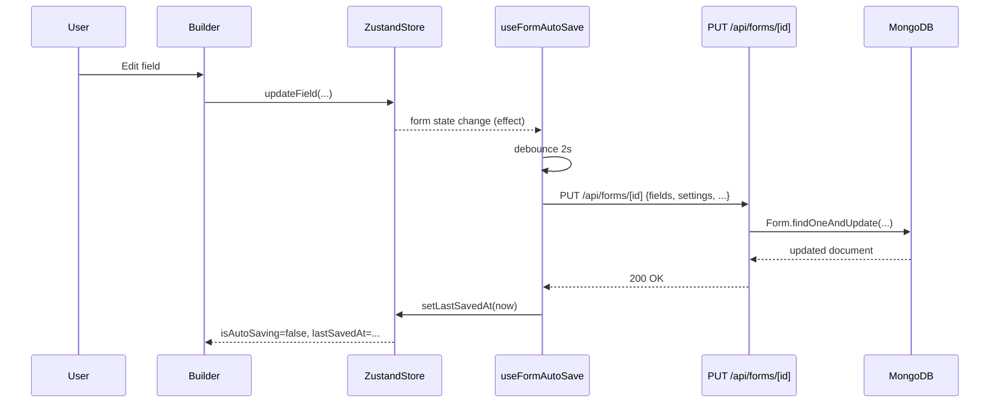
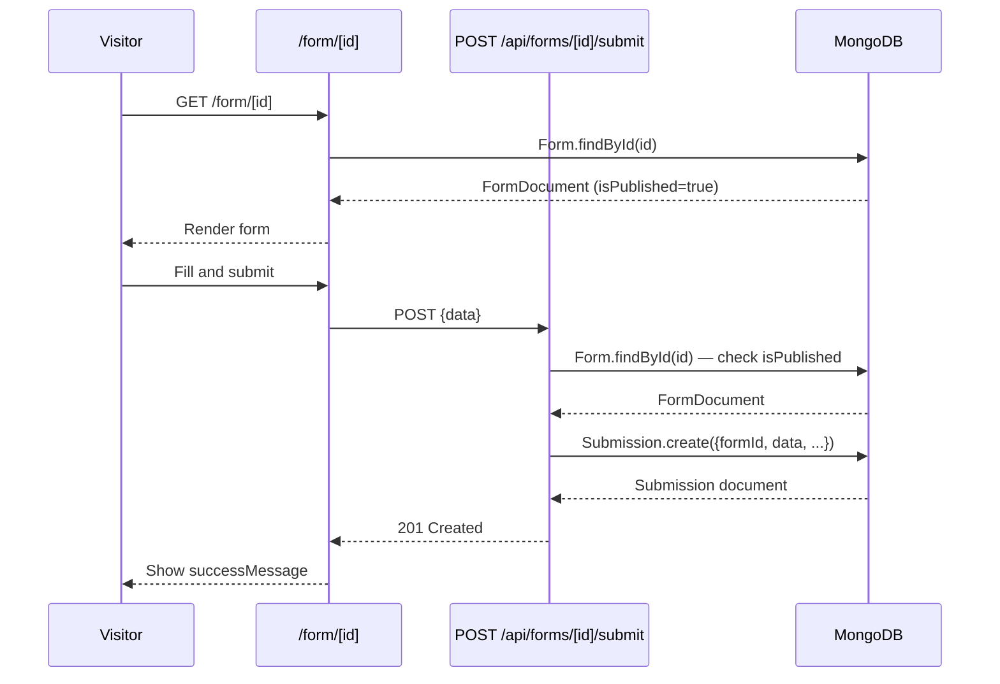
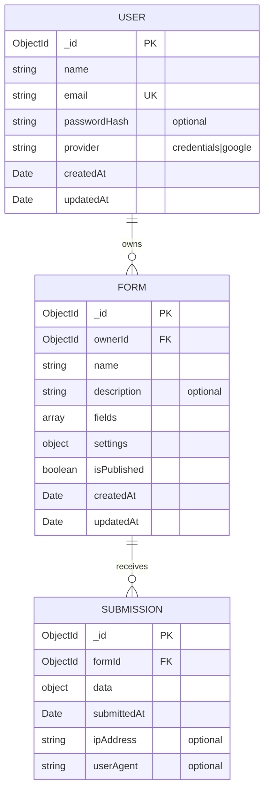

# Design Document: MongoDB Auth and Features

## Overview

This document describes the technical design for adding authentication, persistent MongoDB storage, a user dashboard, real form previews, multi-step form rendering, persistent submissions, and form publishing to the existing Next.js Form Builder application.

The existing builder (undo/redo, drag-drop, auto-save, 16 field types, Zustand store) is preserved unchanged. All new server-side persistence uses MongoDB Atlas via Mongoose. Authentication is handled by NextAuth.js v4 with Email/Password credentials and Google OAuth.

### New Dependencies

```
next-auth@4          — Authentication (v4, stable with App Router via compatibility layer)
mongoose             — MongoDB ODM
bcryptjs             — Password hashing
@types/bcryptjs      — TypeScript types for bcryptjs
```

> **Why next-auth v4 (not v5)?** NextAuth v5 is still in beta. v4 has a well-established App Router compatibility pattern using the `[...nextauth]` catch-all route handler and `getServerSession(authOptions)` for server components.

---

## Architecture

### High-Level Component Diagram

```mermaid
graph TB
    subgraph Client
        Builder["Builder (app/page.tsx)"]
        Dashboard["Dashboard (app/dashboard/page.tsx)"]
        FormRenderer["Form Renderer (app/form/[id]/page.tsx)"]
        SignIn["Sign In (app/auth/signin/page.tsx)"]
        SignUp["Sign Up (app/auth/signup/page.tsx)"]
        Submissions["Submissions (app/dashboard/[formId]/submissions/page.tsx)"]
    end

    subgraph Middleware
        MW["middleware.ts — Route Protection"]
    end

    subgraph API["API Routes (app/api/)"]
        AuthAPI["auth/[...nextauth]/route.ts"]
        FormsAPI["forms/route.ts (GET, POST)"]
        FormAPI["forms/[id]/route.ts (GET, PUT, DELETE)"]
        PublishAPI["forms/[id]/publish/route.ts (PATCH)"]
        SubmitAPI["forms/[id]/submit/route.ts (POST)"]
        SubsAPI["forms/[id]/submissions/route.ts (GET)"]
    end

    subgraph Lib["lib/"]
        MongoDB["mongodb.ts — Connection Singleton"]
        AuthConfig["auth.ts — authOptions"]
        UserModel["models/User.ts"]
        FormModel["models/Form.ts"]
        SubmissionModel["models/Submission.ts"]
    end

    subgraph External
        MongoAtlas["MongoDB Atlas"]
        GoogleOAuth["Google OAuth"]
        NextAuth["NextAuth.js v4"]
    end

    Builder -->|PUT /api/forms/[id]| FormAPI
    Builder -->|POST /api/forms| FormsAPI
    Dashboard -->|Direct DB query| FormModel
    FormRenderer -->|GET /api/forms/[id]| FormAPI
    FormRenderer -->|POST /api/forms/[id]/submit| SubmitAPI
    Submissions -->|GET /api/forms/[id]/submissions| SubsAPI

    MW --> AuthAPI
    AuthAPI --> AuthConfig
    AuthConfig --> UserModel
    AuthConfig --> GoogleOAuth

    FormsAPI --> FormModel
    FormAPI --> FormModel
    PublishAPI --> FormModel
    SubmitAPI --> SubmissionModel
    SubsAPI --> SubmissionModel

    FormModel --> MongoDB
    UserModel --> MongoDB
    SubmissionModel --> MongoDB
    MongoDB --> MongoAtlas
```

### Request Flow: Authenticated Builder Auto-Save



### Request Flow: Public Form Submission



---

## Components and Interfaces

### File Structure

```
lib/
  mongodb.ts                    — Mongoose connection singleton
  auth.ts                       — NextAuth authOptions
  models/
    User.ts                     — Mongoose User model
    Form.ts                     — Mongoose Form model
    Submission.ts               — Mongoose Submission model

app/
  auth/
    signin/page.tsx             — Login page (client component)
    signup/page.tsx             — Signup page (client component)
  dashboard/
    page.tsx                    — Dashboard (server component)
    [formId]/
      submissions/
        page.tsx                — Submissions view (server component)
  form/
    [id]/
      page.tsx                  — Public form renderer (replaces hardcoded demo)
  api/
    auth/
      [...nextauth]/
        route.ts                — NextAuth handler
    forms/
      route.ts                  — GET (list) + POST (create)
      [id]/
        route.ts                — GET + PUT + DELETE
        publish/
          route.ts              — PATCH toggle publish
        submit/
          route.ts              — POST submission
        submissions/
          route.ts              — GET submissions list

middleware.ts                   — Protect / and /dashboard routes
```

### `lib/mongodb.ts` — Connection Singleton

```typescript
import mongoose from 'mongoose'

declare global {
  var _mongooseConn: Promise<typeof mongoose> | undefined
}

export async function connectDB(): Promise<typeof mongoose> {
  if (global._mongooseConn) return global._mongooseConn
  global._mongooseConn = mongoose.connect(process.env.MONGODB_URI!)
  return global._mongooseConn
}
```

The global cache prevents creating a new connection on every serverless invocation. The `MONGODB_URI` environment variable must be set in `.env.local`.

### `lib/auth.ts` — NextAuth Configuration

```typescript
import { NextAuthOptions } from 'next-auth'
import CredentialsProvider from 'next-auth/providers/credentials'
import GoogleProvider from 'next-auth/providers/google'
import bcrypt from 'bcryptjs'
import { connectDB } from './mongodb'
import User from './models/User'

export const authOptions: NextAuthOptions = {
  providers: [
    CredentialsProvider({
      name: 'credentials',
      credentials: {
        email: { label: 'Email', type: 'email' },
        password: { label: 'Password', type: 'password' },
      },
      async authorize(credentials): Promise<{ id: string; name: string; email: string } | null> {
        if (!credentials?.email || !credentials?.password) return null
        await connectDB()
        const user = await User.findOne({ email: credentials.email })
        if (!user || !user.passwordHash) return null
        const isValid = await bcrypt.compare(credentials.password, user.passwordHash)
        if (!isValid) return null
        return { id: user._id.toString(), name: user.name, email: user.email }
      },
    }),
    GoogleProvider({
      clientId: process.env.GOOGLE_CLIENT_ID!,
      clientSecret: process.env.GOOGLE_CLIENT_SECRET!,
    }),
  ],
  session: { strategy: 'jwt' },
  callbacks: {
    async signIn({ user, account, profile }) {
      if (account?.provider === 'google') {
        await connectDB()
        await User.findOneAndUpdate(
          { email: user.email },
          {
            $setOnInsert: { name: user.name, email: user.email, provider: 'google' },
          },
          { upsert: true, new: true }
        )
      }
      return true
    },
    async jwt({ token, user }) {
      if (user) token.id = user.id
      return token
    },
    async session({ session, token }) {
      if (token.id) session.user.id = token.id as string
      return session
    },
  },
  pages: {
    signIn: '/auth/signin',
    error: '/auth/signin',
  },
}
```

### `middleware.ts` — Route Protection

```typescript
import { withAuth } from 'next-auth/middleware'
import { NextResponse } from 'next/server'

export default withAuth(
  function middleware(req) {
    return NextResponse.next()
  },
  {
    callbacks: {
      authorized: ({ token }) => !!token,
    },
  }
)

export const config = {
  matcher: ['/', '/dashboard/:path*'],
}
```

Routes not in `matcher` (e.g. `/form/[id]`, `/auth/signin`, `/auth/signup`) are publicly accessible by default.

### API Route Interfaces

All API routes follow the existing `ApiResponse<T>` envelope from `lib/types.ts`:

```typescript
interface ApiResponse<T> {
  success: boolean
  data?: T
  error?: string
  timestamp: string
}
```

#### `POST /api/forms` — Create Form

```typescript
// Request body
interface CreateFormRequest {
  name: string
  description?: string
}

// Response: ApiResponse<FormDocument>
// Status: 201 Created | 401 Unauthorized
```

#### `GET /api/forms` — List User's Forms

```typescript
// No request body
// Response: ApiResponse<FormDocument[]>
// Status: 200 OK | 401 Unauthorized
```

#### `GET /api/forms/[id]` — Get Single Form

```typescript
// Response: ApiResponse<FormDocument>
// Status: 200 OK | 404 Not Found
// Note: No auth required (used by public form renderer)
```

#### `PUT /api/forms/[id]` — Update Form

```typescript
// Request body: Partial<FormSchema> (name, description, fields, settings)
// Response: ApiResponse<FormDocument>
// Status: 200 OK | 401 Unauthorized | 403 Forbidden | 404 Not Found
```

#### `DELETE /api/forms/[id]` — Delete Form

```typescript
// Response: ApiResponse<null>
// Status: 200 OK | 401 Unauthorized | 403 Forbidden | 404 Not Found
// Side effect: also deletes all Submission documents for this form
```

#### `PATCH /api/forms/[id]/publish` — Toggle Publish

```typescript
// Request body
interface PublishRequest {
  isPublished: boolean
}

// Response: ApiResponse<{ isPublished: boolean }>
// Status: 200 OK | 401 Unauthorized | 403 Forbidden | 404 Not Found
```

#### `POST /api/forms/[id]/submit` — Submit Form

```typescript
// Request body
interface SubmitFormRequest {
  data: Record<string, unknown>
}

// Response: ApiResponse<SubmissionDocument>
// Status: 201 Created | 403 Forbidden (unpublished) | 404 Not Found
```

#### `GET /api/forms/[id]/submissions` — List Submissions

```typescript
// Response: ApiResponse<SubmissionDocument[]>
// Status: 200 OK | 401 Unauthorized | 403 Forbidden | 404 Not Found
```

### Updated `useFormAutoSave` Hook Interface

The existing hook in `hooks/use-form-builder.ts` is extended to support MongoDB sync when a session is present:

```typescript
export function useFormAutoSave(formId: string, interval: number = 2000): {
  saveForm: () => void
}
```

Internally, the hook checks `useSession()` from `next-auth/react`. When a session exists and `formId` is a valid MongoDB ObjectId, it calls `PUT /api/forms/[formId]`. When no session exists, it falls back to `localStorage` only (existing behavior preserved).

### `BuilderHeader` Props Extension

The existing `BuilderHeader` component receives two new props:

```typescript
interface BuilderHeaderProps {
  // ... existing props ...
  saveStatus: 'idle' | 'saving' | 'saved' | 'error'
  isPublished: boolean
  onPublishToggle: () => void
}
```

### Multi-Step Logic: `splitIntoSteps`

A pure utility function in `lib/utils.ts`:

```typescript
export interface FormStep {
  title: string        // section-header label, or form name for step 0
  fields: FormField[]  // non-section-header fields in this step
}

/**
 * Splits a fields array into steps using section-header fields as boundaries.
 * If no section-headers exist, returns a single step containing all fields.
 */
export function splitIntoSteps(fields: FormField[], formName: string): FormStep[]
```

**Algorithm:**
1. Scan `fields` left-to-right.
2. When a `section-header` field is encountered, close the current step and open a new one with the header's `label` as the step title.
3. Non-section-header fields are appended to the current step's `fields` array.
4. If no section-headers exist, return `[{ title: formName, fields: allFields }]`.

---

## Data Models

### `lib/models/User.ts`

```typescript
import mongoose, { Schema, Document, Model } from 'mongoose'

export interface IUser extends Document {
  name: string
  email: string
  passwordHash?: string
  provider: 'credentials' | 'google'
  createdAt: Date
  updatedAt: Date
}

const UserSchema = new Schema<IUser>(
  {
    name: { type: String, required: true },
    email: { type: String, required: true, unique: true, index: true },
    passwordHash: { type: String },
    provider: { type: String, enum: ['credentials', 'google'], required: true },
  },
  { timestamps: true }
)

const User: Model<IUser> =
  mongoose.models.User || mongoose.model<IUser>('User', UserSchema)

export default User
```

### `lib/models/Form.ts`

```typescript
import mongoose, { Schema, Document, Model, Types } from 'mongoose'
import { FormField, FormSettings } from '@/lib/types'

export interface IForm extends Document {
  ownerId: Types.ObjectId
  name: string
  description?: string
  fields: FormField[]
  settings: FormSettings
  isPublished: boolean
  createdAt: Date
  updatedAt: Date
}

const FormSchema = new Schema<IForm>(
  {
    ownerId: { type: Schema.Types.ObjectId, ref: 'User', required: true, index: true },
    name: { type: String, required: true },
    description: { type: String },
    fields: { type: Schema.Types.Mixed, default: [] },
    settings: { type: Schema.Types.Mixed, required: true },
    isPublished: { type: Boolean, default: false },
  },
  { timestamps: true }
)

const Form: Model<IForm> =
  mongoose.models.Form || mongoose.model<IForm>('Form', FormSchema)

export default Form
```

### `lib/models/Submission.ts`

```typescript
import mongoose, { Schema, Document, Model, Types } from 'mongoose'

export interface ISubmission extends Document {
  formId: Types.ObjectId
  data: Record<string, unknown>
  submittedAt: Date
  ipAddress?: string
  userAgent?: string
}

const SubmissionSchema = new Schema<ISubmission>(
  {
    formId: { type: Schema.Types.ObjectId, ref: 'Form', required: true, index: true },
    data: { type: Schema.Types.Mixed, required: true },
    submittedAt: { type: Date, default: Date.now },
    ipAddress: { type: String },
    userAgent: { type: String },
  },
  { timestamps: false }
)

const Submission: Model<ISubmission> =
  mongoose.models.Submission ||
  mongoose.model<ISubmission>('Submission', SubmissionSchema)

export default Submission
```

### Entity Relationship Diagram



### NextAuth Session Type Extension

```typescript
// types/next-auth.d.ts
import 'next-auth'

declare module 'next-auth' {
  interface Session {
    user: {
      id: string
      name?: string | null
      email?: string | null
      image?: string | null
    }
  }
}

declare module 'next-auth/jwt' {
  interface JWT {
    id: string
  }
}
```

---

## Correctness Properties

*A property is a characteristic or behavior that should hold true across all valid executions of a system — essentially, a formal statement about what the system should do. Properties serve as the bridge between human-readable specifications and machine-verifiable correctness guarantees.*

### Property Reflection

Before writing properties, redundancies are eliminated:

- 1.2 (user created on signup) and 1.5 (password stored as hash) can be combined: a single registration property verifies both that the user is created AND that the stored credential is a bcrypt hash, not plaintext.
- 4.1 (redirect / when unauthenticated) and 4.2 (redirect /dashboard when unauthenticated) are both instances of the same middleware rule — combined into one property over all protected routes.
- 4.3 (allow access when authenticated) is the inverse of the combined 4.1/4.2 property — kept separate as it tests a different code path.
- 6.6 (403 for non-owner mutation) and 13.5 (403 for non-owner submissions) are both instances of the ownership authorization rule — combined into one property over all owner-protected endpoints.
- 9.1–9.3 (publish toggle) form a round-trip property.
- 11.1–11.2 (step splitting) are both captured by the `splitIntoSteps` pure function property.

---

### Property 1: Registration creates a user with a hashed password

*For any* valid registration input (non-empty name, valid email, password of length ≥ 8), calling the registration handler should create exactly one User document in the database with the given email, and the stored `passwordHash` should satisfy `bcrypt.compare(plaintext, hash) === true` while `passwordHash !== plaintext`.

**Validates: Requirements 1.2, 1.5**

---

### Property 2: Duplicate email registration is rejected

*For any* email address that already exists in the users collection, attempting to register a new account with that same email should return a duplicate-email error and should NOT create a second User document.

**Validates: Requirements 1.3**

---

### Property 3: Short passwords are rejected by validation

*For any* string with `length < 8`, the password validation function should return an error result (isValid: false) and should not proceed to hash or store the value.

**Validates: Requirements 1.4**

---

### Property 4: Valid credentials authorize successfully; invalid credentials do not

*For any* registered user, calling `authorize` with the correct email and password should return a non-null user object. *For any* (email, password) pair where either the email is not registered or the password does not match the stored hash, `authorize` should return `null` — without distinguishing which field was wrong.

**Validates: Requirements 2.2, 2.3**

---

### Property 5: Google sign-in upserts exactly one User document

*For any* Google OAuth profile (new or returning), the `signIn` callback should result in exactly one User document in the database with the profile's email — creating it if absent, leaving it unchanged if already present.

**Validates: Requirements 2.4**

---

### Property 6: Unauthenticated requests to protected routes are redirected

*For any* HTTP request to a path matching the middleware `matcher` (`/` or `/dashboard/**`) that does not carry a valid JWT session token, the middleware should respond with a redirect to `/auth/signin`.

**Validates: Requirements 4.1, 4.2**

---

### Property 7: Authenticated requests to protected routes are allowed through

*For any* HTTP request to a protected route that carries a valid JWT session token, the middleware should call `NextResponse.next()` and not redirect.

**Validates: Requirements 4.3**

---

### Property 8: Non-owner requests to owner-protected endpoints return 403

*For any* (authenticatedUserId, formId) pair where `authenticatedUserId !== form.ownerId`, any mutating request (PUT, DELETE, PATCH publish, GET submissions) to that form's endpoints should return HTTP 403 and leave the database unchanged.

**Validates: Requirements 6.6, 13.5**

---

### Property 9: Requests referencing non-existent forms return 404

*For any* form ID that does not exist in the `forms` collection, any request to `/api/forms/[id]` (GET, PUT, DELETE, PATCH publish, POST submit, GET submissions) should return HTTP 404.

**Validates: Requirements 6.7**

---

### Property 10: Auto-save calls the API when authenticated, localStorage when not

*For any* form state change, if a valid session exists the auto-save hook should invoke `PUT /api/forms/[id]` with the current schema and should NOT write to localStorage as the primary store. If no session exists, the hook should write to localStorage and should NOT call the API.

**Validates: Requirements 7.1, 7.2**

---

### Property 11: Publish toggle is a round-trip

*For any* form, toggling `isPublished` from its current value to the opposite and then back again should result in the form's `isPublished` field returning to its original value.

**Validates: Requirements 9.1, 9.2, 9.3**

---

### Property 12: Unpublished forms deny unauthenticated submission

*For any* form with `isPublished: false`, a POST request to `/api/forms/[id]/submit` without a valid session should return HTTP 403 and should NOT create a Submission document.

**Validates: Requirements 9.4, 10.3**

---

### Property 13: Valid submissions to published forms are persisted

*For any* valid submission payload sent to a published form, the API should create a Submission document in MongoDB with `formId` matching the form's `_id` and `data` matching the submitted payload, and return HTTP 201.

**Validates: Requirements 10.1, 10.2**

---

### Property 14: `splitIntoSteps` correctly partitions fields at section-header boundaries

*For any* array of `FormField` objects, `splitIntoSteps` should produce steps such that:
1. Every `section-header` field becomes a step title boundary and does not appear in any step's `fields` array.
2. Every non-section-header field appears in exactly one step's `fields` array.
3. The relative order of non-section-header fields is preserved across steps.
4. If no `section-header` fields exist, exactly one step is returned containing all fields.

**Validates: Requirements 11.1, 11.2**

---

## Error Handling

### API Error Response Strategy

All API routes return errors using the `ApiResponse<null>` envelope with an appropriate HTTP status code:

| Condition | Status | `error` field |
|---|---|---|
| Missing or invalid session | 401 | `"Unauthorized"` |
| Authenticated but not the owner | 403 | `"Forbidden"` |
| Resource not found | 404 | `"Not found"` |
| Validation failure | 400 | Descriptive message |
| Unexpected server error | 500 | `"Internal server error"` |

For 401/403 errors, the response body deliberately omits details that could reveal whether a resource exists (prevents enumeration attacks).

### Authentication Error Handling

- **Credentials provider**: `authorize` returns `null` on any failure (wrong email or wrong password). NextAuth maps this to a generic `"CredentialsSignin"` error code, which the sign-in page displays as a single non-specific message.
- **Google OAuth errors**: Handled by NextAuth's built-in error page, redirected to `/auth/signin?error=...`.
- **Session expiry**: The `withAuth` middleware automatically redirects expired sessions to `/auth/signin`.

### MongoDB Connection Errors

- The `connectDB()` singleton throws if `MONGODB_URI` is undefined or the connection fails.
- API routes do not catch connection errors individually — they propagate as 500 responses.
- In development, a missing `MONGODB_URI` produces a clear startup error.

### Auto-Save Error States

The `useFormAutoSave` hook exposes a `saveStatus` value (`'idle' | 'saving' | 'saved' | 'error'`) surfaced in the builder header. On a failed PUT, the status is set to `'error'` and the hook retries on the next form change.

### Form Renderer Error States

- **Form not found**: Renders a "Form not found" message with a link back to the home page.
- **Form unpublished (unauthenticated)**: Renders a "This form is not available" message.
- **Submission failure**: Displays `settings.errorMessage` from the form schema.
- **Submission success**: Displays `settings.successMessage` and hides the form.

---

## Testing Strategy

### Dual Testing Approach

Unit tests cover specific examples, edge cases, and error conditions. Property-based tests verify universal properties across many generated inputs. Both are necessary for comprehensive coverage.

### Property-Based Testing Library

**[fast-check](https://github.com/dubzzz/fast-check)** — TypeScript-native, works with Jest/Vitest, supports complex arbitraries for objects and arrays.

Install: `npm install --save-dev fast-check`

Each property test runs a minimum of **100 iterations**. Tests are tagged with a comment referencing the design property:

```typescript
// Feature: mongodb-auth-and-features, Property 14: splitIntoSteps correctly partitions fields
it('splitIntoSteps: section-headers become step boundaries', () => {
  fc.assert(
    fc.property(fc.array(arbFormField), (fields) => {
      const steps = splitIntoSteps(fields, 'Test Form')
      // ... assertions ...
    }),
    { numRuns: 100 }
  )
})
```

### Unit Tests (Example-Based)

- **Auth pages**: Render tests asserting required form fields and buttons are present (Requirements 1.1, 2.1, 3.1).
- **Builder load behavior**: Mock `fetch` to verify the builder calls `GET /api/forms/[id]` on mount when a session exists, and `POST /api/forms` when no form is found (Requirements 7.3, 7.4).
- **Dashboard rendering**: Render with mock form data and assert form cards display name, status badge, submission count, and action buttons (Requirement 12.3).
- **Submissions view**: Render with mock submissions and assert each submission's date and field values are displayed (Requirement 13.3).
- **Form renderer — success/error messages**: Submit a form and assert the success/error message is displayed (Requirements 10.5, 10.6).

### Property-Based Tests

Each property from the Correctness Properties section maps to one property-based test:

| Property | Test file | Arbitraries |
|---|---|---|
| P1: Registration creates hashed user | `__tests__/auth/register.test.ts` | `fc.string()` for name, `fc.emailAddress()`, `fc.string({ minLength: 8 })` for password |
| P2: Duplicate email rejected | `__tests__/auth/register.test.ts` | `fc.emailAddress()` |
| P3: Short passwords rejected | `__tests__/auth/validation.test.ts` | `fc.string({ maxLength: 7 })` |
| P4: Credentials authorize | `__tests__/auth/authorize.test.ts` | `fc.record({ email: fc.emailAddress(), password: fc.string({ minLength: 8 }) })` |
| P5: Google upsert | `__tests__/auth/google-signin.test.ts` | `fc.record({ email: fc.emailAddress(), name: fc.string() })` |
| P6: Unauthenticated redirect | `__tests__/middleware.test.ts` | `fc.constantFrom('/', '/dashboard', '/dashboard/abc')` |
| P7: Authenticated allow-through | `__tests__/middleware.test.ts` | Same paths with valid token |
| P8: Non-owner 403 | `__tests__/api/forms-auth.test.ts` | `fc.string()` for userId pairs |
| P9: Non-existent form 404 | `__tests__/api/forms-notfound.test.ts` | `fc.string()` for random IDs |
| P10: Auto-save routing | `__tests__/hooks/use-form-auto-save.test.ts` | `fc.record(...)` for FormSchema |
| P11: Publish round-trip | `__tests__/api/publish.test.ts` | `fc.boolean()` for initial isPublished |
| P12: Unpublished form 403 | `__tests__/api/submit.test.ts` | `fc.record(...)` for submission data |
| P13: Valid submission persisted | `__tests__/api/submit.test.ts` | `fc.dictionary(fc.string(), fc.string())` for data |
| P14: splitIntoSteps partitioning | `__tests__/lib/split-steps.test.ts` | `fc.array(arbFormField)` |

### Integration Tests

- **MongoDB connection reuse**: Verify `connectDB()` returns the same connection across multiple calls (Requirement 5.4).
- **End-to-end form submission**: Create a form, publish it, submit data, verify the Submission document in the database (Requirements 10.1, 10.2).
- **Dashboard data fetch**: Verify the dashboard server component returns only forms owned by the authenticated user.

### Test Configuration

```typescript
// jest.config.ts (or vitest.config.ts)
// Property tests: numRuns: 100 minimum
// Tag format: "Feature: mongodb-auth-and-features, Property N: <property_text>"
```
